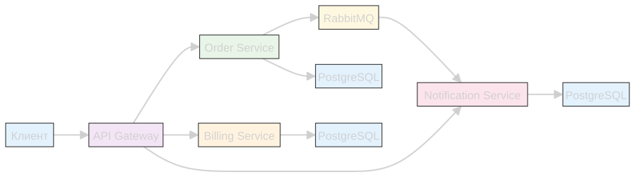

# Система заказов с RabbitMQ

Микросервисная система заказов с использованием RabbitMQ.

## Архитектура

- **API Gateway** - точка входа для всех запросов
- **Order Service** - управление заказами
- **Billing Service** - управление счетами и платежами
- **Notification Service** - отправка уведомлений
- **Delivery Service** - доставка
- **Warehouse Service** - управление складом и резервирование товаров
- **RabbitMQ** - брокер сообщений
- **PostgreSQL** - база данных для каждого сервиса



## Быстрый старт

### Развертывание

```bash
kubectl apply -f k8s/namespaces.yaml

kubectl apply -f k8s/rabbitmq.yaml
kubectl apply -f k8s/rabbitmq-ingress.yaml
kubectl apply -f k8s/rabbitmq-static-ingress.yaml

kubectl wait --namespace infrastructure --for=condition=ready pod --selector=app=rabbitmq --timeout=60s

kubectl apply -f k8s/billing-service.yaml
kubectl apply -f k8s/warehouse-service.yaml
kubectl apply -f k8s/delivery-service.yaml
kubectl apply -f k8s/notification-service.yaml
kubectl apply -f k8s/order-service.yaml
kubectl apply -f k8s/api-gateway.yaml

kubectl wait --namespace billing-system --for=condition=ready pod --selector=app=billing-service --timeout=30s
kubectl wait --namespace warehouse-system --for=condition=ready pod --selector=app=warehouse-service --timeout=30s
kubectl wait --namespace delivery-system --for=condition=ready pod --selector=app=delivery-service --timeout=30s
kubectl wait --namespace notification-system --for=condition=ready pod --selector=app=notification-service --timeout=30s
kubectl wait --namespace order-system --for=condition=ready pod --selector=app=order-service --timeout=30s
kubectl wait --namespace api-gateway-system --for=condition=ready pod --selector=app=api-gateway --timeout=30s
```
либо
```bash
./deploy.sh
```

### Удаление

```bash
kkubectl delete namespace api-gateway-system --ignore-not-found=true
kubectl delete namespace notification-system --ignore-not-found=true
kubectl delete namespace billing-system --ignore-not-found=true
kubectl delete namespace order-system --ignore-not-found=true
kubectl delete namespace delivery-system --ignore-not-found=true
kubectl delete namespace warehouse-system --ignore-not-found=true
kubectl delete namespace infrastructure --ignore-not-found=true
```
либо
```bash
./cleanup.sh
```

## Доступные URL

- **API Gateway**: http://arch.homework/api/v1/ ....
- **RabbitMQ Management**: http://arch.homework/rabbitmq (admin/admin)

## API Endpoints

[API Gateway Order System Tests.postman_collection.json](postman/API%20Gateway%20Order%20System%20Tests.postman_collection.json)

### для SAGA использовать секцию
`Управление заказами (Saga)`